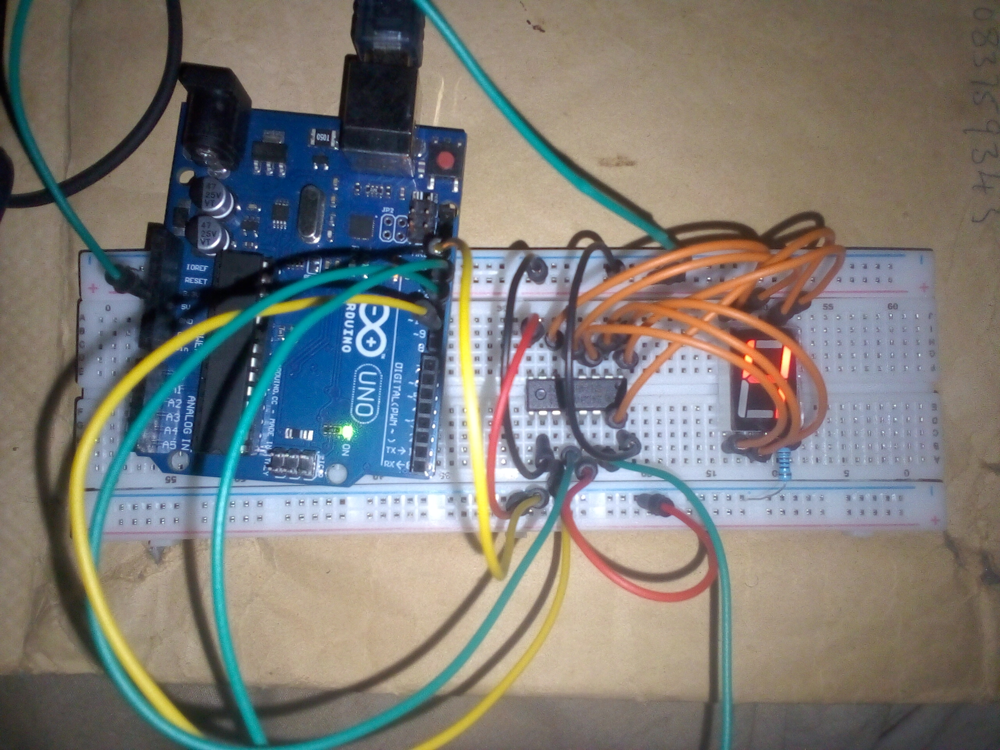

# 7-Segment Control with 74HC595 Shift Register - ARDUINO PROJECT

## Overview
This project demonstrates how to control a single 7-segment display using a 74HC595 shift register and an Arduino. By using the shift register, the number of Arduino pins required to drive the 7-segment display is reduced, making the design more efficient and scalable.

## Objective
- Learn how to interface a 74HC595 shift register with Arduino  
- Understand serial-to-parallel data conversion  
- Display numeric digits (0–9) on a 7-segment display  
- Reduce GPIO pin usage using shift registers  

## Components Used
- Arduino Uno  
- 74HC595 Shift Register  
- 1-Digit 7-Segment Display  
- 220Ω resistors  
- Breadboard  
- Jumper wires  
- 9V Battery  
- 9V Battery Clip to DC Barrel Jack  

## Circuit Diagram

[Click Here for other images](images/)

## How It Works
1. The Arduino sends binary data serially to the 74HC595 shift register using the `shiftOut()` function.
2. The shift register converts the serial data into parallel outputs.
3. Each output pin of the shift register controls a segment of the 7-segment display.
4. Binary patterns corresponding to digits 0–9 are sent sequentially.
5. The latch pin updates the output, displaying the current digit on the 7-segment display.
6. A delay is used between digits to clearly observe each number.

## Code
The Arduino sketch for this project is located in the [code/ directory](code/7segment_control_595register_project_on_14th_November_2025.jpg).

## Demo Video
A demonstration video of the project is included in this repository.

📹 **Project Demonstration:**  
[Click here to watch/download the demo video](video/7segment_control_with_595_register_photo2.mo4)

*(If the video does not preview directly on GitHub, please download it using the link above.)*

## Reflection (What I Learned)
- How shift registers work  
- Serial data transmission using `shiftOut()`  
- Efficient pin management in Arduino projects  
- Mapping binary values to 7-segment displays  

## Challenges Faced
- Correctly mapping segment pins to binary values  
- Understanding latch, clock, and data pin timing  

## Possible Improvements
- Add multiple 7-segment displays using cascading  
- Implement a counter or timer instead of fixed delays  
- Control the display using buttons or sensors  
- Replace delays with `millis()` for smoother operation  

## Project Status
Completed
